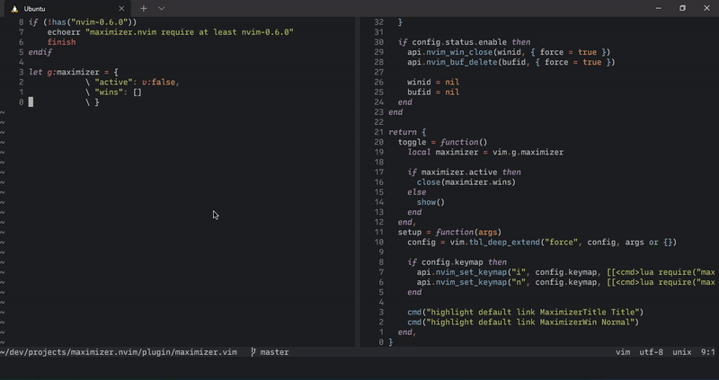

# Maximizer.nvim

A plugin for neovim `>= 0.6.0` that allows you to maximize and restore the current window.



## Installation

### [packer.nvim](https://github.com/wbthomason/packer.nvim)

```lua
use "eduardomillans/maximizer.nvim"
```

### [vim-plug](https://github.com/junegunn/vim-plug)

```vim
plug "eduardomillans/maximizer.nvim"
```

## Setup

This plugin must be explicitly enabled by using `require("maximizer").setup({})`

```lua
require("maximizer").setup({
  status = {
    enable = true, -- nil or false to disable
    text = "Maximizer is active!",
    blend = 10,
    position = {
      top = true,
      left = false,
    },
  },
  -- toggle keymap
  keymap = {
    enable = true, -- nil or false to disable
    modes = { "i", "n" },
    rhs = "<C-w>z"
  }
})
```

## Highlights

```vim
highlight default link MaximizerTitle Title # Highlight used for the status title.

highlight default link MaximizerWin Normal # Highlight used for the status window.
```

## Credit

- [vim-maximizer](https://github.com/szw/vim-maximizer)
- [fidget.nvim](https://github.com/j-hui/fidget.nvim)
